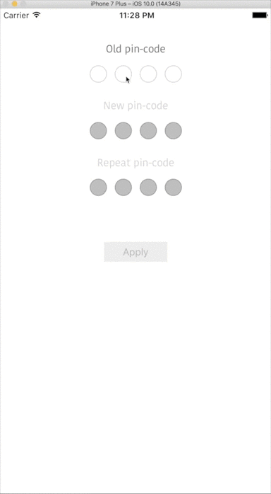

# QUIckControl
Base class for quick implementation UIControl subclass based on standard(enabled, highlighted, selected) and custom states.
Implementation based on KVC.

[](https://travis-ci.org/Denis Koryttsev/QUIckControl)
[](http://cocoapods.org/pods/QUIckControl)
[](http://cocoapods.org/pods/QUIckControl)
[](http://cocoapods.org/pods/QUIckControl)

## Installation

QUIckControl is available through [CocoaPods](http://cocoapods.org). To install
it, simply add the following line to your Podfile:

```ruby
pod "QUIckControl"
```

<h2>Manage states:</h2>

You may to bind value for specific target with state of types:
 - simple state as bitmask (UIControlState);
 - state, which contains in current state (.intersected);
 - all states, which not matched specified state (.inverted);
 - all states, where current state contains one or more specified substates (.oneOfSeveral);
 - all states, where current state not contains specified substates (.noneOfThis);
 - custom state, which you implemented (.custom);
 
All state types have priority and value setup from most high priority state.
In default implementation simple state have priority 1000, intersected 999, inverted 750, oneOfSeveral and noneOfThis 500, custom user defined. For any type of state descriptor you may set your priority.

Example usage:

In most cases, state looks like bool property or him may be represented in bool property. So, before setup value for state, it need register using:
```swift
func register(_ state: UIControlState, forBoolKeyPath keyPath: String, inverted: Bool)
func register(_ state: UIControlState, with predicate: NSPredicate)
```
example:
```swift
register(.disabled, forBoolKeyPath: #keyPath(UIControl.enabled), inverted: true)
register(.valid, with: NSPredicate { control, _ in
    return control.filled && control.valid
})
```

Immediately, after registration you may setup values for this state using:
```swift
func setValue(_ value: Any?, forTarget: NSObject = default, forKeyPath: String, forInvertedState: UIControlState) {
func setValue(_ value: Any?, forTarget: NSObject = default, forKeyPath: String, forAllStatesContained: UIControlState)
func setValue(_ value: Any?, forTarget: NSObject = default, forKeyPath: String, for: UIControlState)
func setValue(_ value: Any?, forTarget: NSObject = default, forKeyPath: String, for: QUICStateDescriptor)
```
examples:
```swift
control.setValue(UIColor.black, forKeyPath: #keyPath(UIView.backgroundColor), forAllStatesContained: .highlighted)
control.setValue("QuickControl sended this string",
                 forTarget:receiver
                 forKeyPath: #keyPath(StringReceiver.value),
                 for: QUICStateDescriptor(state: [.filled, .invalid], priority: 1000, predicate: { $0.contains(.filled) && !$0.contains(.invalid) }))
```
Remove values:
```swift
func removeValues(forTarget target: NSObject, forKeyPath key: String, forState state: UIControlState)
func removeValues(forTarget target: NSObject, forKeyPath key: String)
func removeValues(forTarget target: NSObject? = default)
```

For multiple switches state factors (aka bool property) use transitions:
```swift
func beginTransition()
func endTransition() // without apply current state
func commitTransition() // with apply current state
func performTransition(withCommit commit: Bool = default, transition: () -> Void)
```

<h2>Other possibilities:</h2>

You may subscribe on state and events using:
```swift
func subscribe(on events: UIControlEvents, _ action: @escaping (QUIckControl) -> Void) -> QUIckControlActionTarget
func subscribe(on state: QUICStateDescriptor, _ action: @escaping () -> ())
```
example:
```swift
control.subscribe(on: QUICStateDescriptor(intersected: .valid), { button.enabled = true })
```

# PinCodeControl

<p align="center">
  
</p>

QUIckControl subclass, which is used for input PIN code. It uses programming states for change visual view.

```ruby
pod "PinCodeControl"
```

Custom event and states:
```swift
extension UIControlEvents {
    public static var typeComplete = UIControlEvents(rawValue: 1 << 24)
}
extension UIControlState {
    public static var filled = UIControlState(rawValue: 1 << 16)
    public static var invalid = UIControlState(rawValue: 1 << 17)
    public static var valid = UIControlState(rawValue: (1 << 18) | filled.rawValue)
}
// preset state descriptors
enum States {
    static public let plain: QUICStateDescriptor
    static public let valid: QUICStateDescriptor
    static public let invalid: QUICStateDescriptor
    static public let highlighted: QUICStateDescriptor
    static public let disabled: QUICStateDescriptor
}
```

Main API
```swift
var code: String { get } // entered code
var filled: Bool { get } // enabled, when all code entered
var valid: Bool { get } // disabled, when entered code invalid
var validator: BlockPredicate<String>? // object for user validation pin code value
var shouldUseDefaultValidation: Bool // if true, then code equal strings, such as '1111', '1234', '9876' will be defined as invalid values
var filledItemColor: UIColor? // color for entered code element
var itemPath: UIBezierPath? // bezier path for code element

init(parameters: Parameters, frame: CGRect? = default) // main initializer
func clear() // clear all entered code

// methods for set parameters for each state
func setFillColor(fillColor: UIColor?, for state: QUICStateDescriptor)
func setBorderColor(borderColor: UIColor?, for state: QUICStateDescriptor)
func setBorderWidth(borderWidth: CGFloat, for state: QUICStateDescriptor)
func setForValidState(fillColor: UIColor?, borderColor: UIColor?, borderWidth: CGFloat)
func setForInvalidState(fillColor: UIColor?, borderColor: UIColor?, borderWidth: CGFloat)
func setForPlainState(fillColor: UIColor?, borderColor: UIColor?, borderWidth: CGFloat)
func setForHighlightedState(fillColor: UIColor?, borderColor: UIColor?, borderWidth: CGFloat)
func setForDisabledState(fillColor: UIColor?, borderColor: UIColor?, borderWidth: CGFloat)
// validation
func validate() -> Bool // perform validation current code value
func validate(_ pin: String) -> Bool // method for validation entered pin code. Declared for subclasses override.
```

<h2>Support information:</h2>
Objective C version is not supported.

For quick research pattern this implementation, you may see project:
https://github.com/k-o-d-e-n/Statable

## Author

Denis Koryttsev, koden.u8800@gmail.com

## License

QUIckControl is available under the MIT license. See the LICENSE file for more info.
